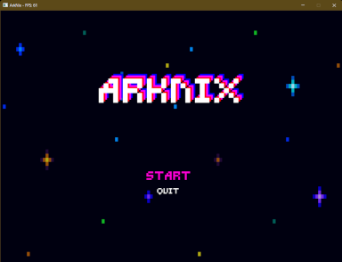
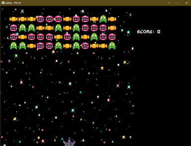

# ArkNix

[](https://wakatime.com/badge/user/52b07b43-d885-460d-9f43-aff8564c26f1/project/3f31fdfb-1ee7-47f9-b23f-8e4f16e6c8cd)

This repo contains my Udacity Capstone project, called ArkNix, it is a mix between Galaga and Space Invaders.

I selected the **Capstone Option 1** and I made a Video game.

### Demo

 

https://user-images.githubusercontent.com/4169949/189512999-838427f3-3354-4f94-b1ee-2ad550113da7.mp4

## Getting Started

These instructions will get you a copy of the project up and running on your local machine for development and testing
purposes.

### Cloning

In order to clone this project, be sure to use the --recurse-submodules flag.

``
git clone --recurse-submodules https://github.com/BennyFranco/CppND-Capstone-Galaga.git
``

The project includes the following submodules:

- SDL2
- SDL2_Image
- SDL2_Mixer
- SDL2_ttf
- yaml-cpp

### Prerequisites

- CMake >= 3.20
    - Instructions [here](https://cmake.org/install/)

### Linux

- gcc/g++ >= 7.4.0
    - In Ubuntu, you could install build-essential with `sudo apt install build-essential` command.

### Windows

- Install Visual Studio 2022
    - Ensure you install the c++ support. Check
      this [post](https://devblogs.microsoft.com/cppblog/getting-started-with-visual-studio-for-c-and-cpp-development/)
      about C++ development with vstudio.
    - This project was NOT tested with MinGW in Windows.

### macOS

- Xcode command line tools

## Compiling and Running

### Compiling

Follow the next steps to compile this project:

1. Create a folder called `build`:

``` 
mkdir build && cd build
```

2. To compile a debug version, run the following cmake config command:

``` 
cmake .. -DCMAKE_BUILD_TYPE=Debug 
```

3. Build the project with:

``` 
cmake --build .
```

### Running

The executable will be placed inside build directory, run it with the following command:

```
./ArkNix
```

## Troubleshooting

### Renderer Issues

In some Ubuntu versions, I had issues creating the window and the renderer of SDL2, if the game shows the following
error
in the console:

```
[SDLRenderer] Window cannot be created. Error: No available video device
[SDLRenderer] Renderer cannot be created. Error: Parameter 'window' is invalid
```

you will need to install `xorg-dev` with the following command:

```
sudo apt-get install xorg-dev
```

you can find more information about this in the
following [link](https://askubuntu.com/questions/443053/could-not-initialize-sdl-no-available-video-device-dont-move).

### Audio Issues

In some Ubuntu versions, I had issues initializing the audio with SDL_mixer, if the game shows the following message
in the console:

```
[SDLAudio] Cannot be initialized. Error: dsp: No such audio device
```

Please, install `libasound2-dev` and `libpulse-dev` with the following command:

```
sudo apt-get install libasound2-dev libpulse-dev
```

more information about this issue in
this [link](http://forums.libsdl.org/viewtopic.php?t=7609&sid=40fdb9756b8e22e1b8253cda3338845f).

## Udacity Rubric

## Files and class structure

Root folders description

| Folder     | Description                                                                               |
|------------|-------------------------------------------------------------------------------------------|
| assets     | all stuff as images, sounds, fonts, etc. goes here.                                       |
| config     | currently only scenes order setup is here                                                 | 
| docs       | documentation stuff                                                                       |
| engine     | it has base elements as audio, base components, <br/> main game loop, asset manager, etc. |
| game       | game specific components and game start point.                                            |
| scenes     | scenes files in yaml                                                                      |
| thirdparty | all project submodules goes here.                                                         |

### Engine Class Diagram

The following diagram is a representation of the most important elements of the engine, these are designed to be
generic.


### Game Class Diagram

The following diagram shows the most important elements of the game, this components are designed in an specific way
for this game.


## Rubric points addressed

### Loops, Functions, I/O

- The project demonstrates an understanding of C++ functions and control structures.
    - A variety of control structures are used in the project: Yes, and some examples in code
      can be found in the following classes and lines of code \<classname:line_number>:
        - Asset reading in: **asset_manager.cpp:29**
        - Update Loop pattern in **game.cpp:47**
        - Collision Test in **collision_detector.cpp:35**
    - The project code is clearly organized into functions: Yes any component in the project is organized as a class
      Check the following classes as examples:
        - **game.cpp**
        - **game_object.cpp**
        - **sprite_component.cpp**
- The project reads data from a file and process the data, or the program writes data to a file.
    - Yes, the game reads scenes from `yaml` files, all scenes are saved in the scenes folder and the reader is located
      in,
      `scene.cpp:95`. I use yaml-cpp library to read this type of files.
    - Also, the game reads images, sounds, fonts using SDL.
- The project accepts user input and processes the input.
    - Yes, the game accepts keyboard input, the keys are described above.

### Object Oriented Programming

- The project uses Object-Oriented Programming techniques.
    - Yes, as I mention before, the project is organized in classes, check any component in `Components` folder, for
      example
      `sprite_component.cpp`, `sound_component.cpp`, `text_component.cpp`, etc.
- Classes use appropriate access specifiers for class members.
    - Yes, please check the classes mentioned before, or any other component.
- Classes abstract implementation details from their interfaces.
    - Yes, please check any component, they use `component.h` as interface.
- Classes encapsulate behavior.
- Classes follow an appropriate inheritance hierarchy.
- Overloaded functions allow the same function to operate on different parameters.
- Derived class functions override virtual base class functions.
    - Feel free to check components folder inside engine, `engine/components`
- Templates generalize functions in the project.
    - Please, check the following class: `asset_manager.h:26`

### Memory Management

- The project makes use of references in function declarations.
    - Yes, Transform is owned by `GameObject` and it's passed as reference to components to sync positions with its
      parent.
      Check any component in `engine/components`.
- The project uses scope / Resource Acquisition Is Initialization (RAII) where appropriate.
- The project follows the Rule of 5.
    - All components were created thinking on this last points, feel free to review any of them.
- The project uses move semantics to move data, instead of copying it, where possible.
    - Check `bullet_controller.cpp:94` as an example.
- The project uses smart pointers instead of raw pointers.
    - Please check: `transform.h:65` and `game_object.h:60`.

### Concurrency

- The project uses multithreading.
    - Check `game_object.cpp:104`
- A mutex or lock is used in the project.
    - Check `scene.cpp:72`

# Asset Credits

- [DOS-88 Synthwave Music Library - DOS88](https://dos88.itch.io/dos-88-music-library)
- [Gravity Font Pack - John Watson](https://jotson.itch.io/gravity-pixel-font)
- [Mini Pixel Pack 3 - GrafxKid](https://grafxkid.itch.io/mini-pixel-pack-3)
- [Space Music Pack - Goose Ninja](https://gooseninja.itch.io/space-music-pack)
- [AlcWilliam Spaceship Pack - alcwilliam](https://alcwilliam.itch.io/alcwilliam-space-ship-pack)
- [Starry Space Parallaxing Background - Enjl](https://enjl.itch.io/background-starry-space)